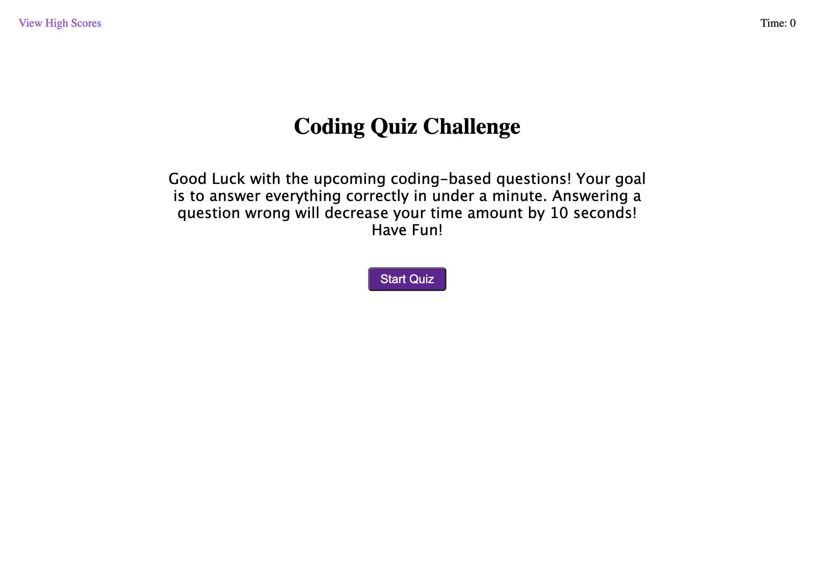

# Code Quiz

## Description

This website is a quiz based platform, that is also like a game. Upon clicking start, a user is prompted with a series of questions, and if guessed wrong will be a penalty. Users score is based on how many answers are answered correctly. And get stored to local storage so the user can keep track of his/her progress.

- My motivation to build this application was to expand my knowledge in JavaScript, Local Storage, Timer Interval Functions, and also to be able to add a really nice web applitcation to my portfolio tha will highly decorate my skill.

## Table of Contents

- [Description](#description)
- [Usage](#usage)
- [Credits](#credits)
- [License](#license)

## Usage 

1. Open a browser (Chrome, Safari, Mozilla, etc.)
2. Direct to the following link (https://fomin2000.github.io/code-quiz/)
3. Read game directions
4. Click Start! A timer will start counting.
5. Answer all questions
6. Save your progress by entering initials.

## Website Link

https://fomin2000.github.io/code-quiz/

## Credits

© Paul Fomin 2022

## License 

MIT License